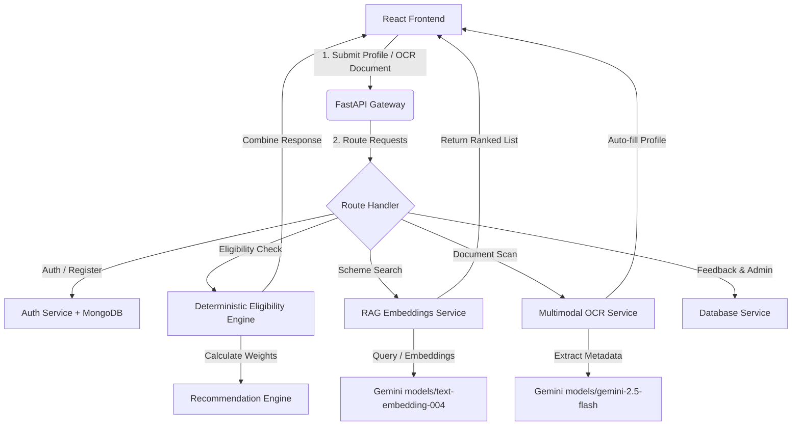

# 🇮🇳 JanSathi AI

AI-Powered Government Scheme Discovery & Eligibility Assistant for Indian citizens. JanSathi AI helps citizens discover relevant central and state government schemes, check their eligibility deterministically, upload documents for automated profile extraction, and receive conversational explanations using GenAI.

---

## 🏗️ Architecture Overview

JanSathi AI is built on a split-service architecture featuring a FastAPI backend and a React + Vite TypeScript frontend, enriched with Google Gemini GenAI integrations.



---

## 🌟 Core Features

### 🔐 1. JWT Authentication & Roles
* Secure registration and login flow with custom validations using Zod.
* **Role-Based Routing**: Restricts administrative controls (scheme uploads, feedback audits) to authorized Admins.
* Seeded demo account for quick evaluation.

### 📋 2. Deterministic Eligibility Engine
* Formulates evaluation rules for **27+ central and state government schemes** (such as *PM Kisan Samman Nidhi*, *Ayushman Bharat*, *Mukhyamantri Majhi Ladki Bahin Yojana*, *Stand-Up India*, and *PMAY*).
* Returns clear eligibility/ineligibility status alongside structured, human-readable reasons.

### 🎯 3. Weighted Recommendation Engine
Calculates a profile-scheme compatibility match score (out of 100) using a multi-factor weight system:
$$\text{Score} = \text{Occupation (30%)} + \text{Income (25%)} + \text{State (20%)} + \text{Age (15%)} + \text{Category (10%)}$$
Enables personalized ranking of eligible schemes to bubble up the most beneficial ones.

### 📄 4. Multimodal OCR Document Scanner
* Upload documents (Aadhaar cards, ration cards, farmer certificates) to automatically extract key profile parameters like name, age, income, state, and occupation.
* Powered by Google's **Gemini Multimodal API (`gemini-2.5-flash`)** with an automatic offline mock fallback.

### 🔍 5. Hybrid Semantic & Lexical RAG Search
* **Semantic Search**: Computes scheme embeddings using **Gemini `text-embedding-004`** and ranks them using Cosine Similarity.
* **Lexical Fallback**: Automatically falls back to a custom keyword/token-matching algorithm if the API is offline or the API key is not configured.
* **Embeddings Cache**: Serializes computed scheme embeddings locally (`embeddings_cache.json`) to minimize API round-trips and maximize performance.

### 💬 6. Conversational AI Scheme Explainer (`ExplainDrawer`)
* Interactive drawer interface offering live explanations for any scheme.
* Leverages Gemini to synthesize complex scheme eligibility, benefits, and step-by-step processes into citizen-friendly language.

---

## 📁 Repository Structure

```text
JanSathi-AI/
├── backend/
│   ├── middleware/            # Rate limiting, logging, and security headers
│   ├── models/                # Pydantic and MongoDB schemas
│   ├── routes/                # Auth, Admin, OCR, Eligibility, and Feedback routes
│   ├── schemas/               # Request/Response validation schemas
│   ├── services/              # Gemini, RAG, Database, OCR, and Recommendation services
│   ├── utils/                 # Security hashing and encryption utilities
│   ├── config.py              # Configuration and settings loader
│   └── main.py                # FastAPI application entry point
├── frontend/
│   ├── dist/                  # Built assets and HTML index
│   ├── src/
│   │   ├── components/        # Layout, forms, cards, and AI ExplainDrawer
│   │   ├── context/           # Auth and state contexts
│   │   ├── hooks/             # Custom toasts and utilities
│   │   ├── pages/             # Dashboard, SchemesPage, EligibilityPage, LandingPage
│   │   ├── services/          # API calling clients (Axios instance)
│   │   └── types.ts           # Shared TypeScript interfaces
│   └── vite.config.ts         # Vite bundler configuration
├── data/
│   └── schemes.json           # Indian Government Schemes dataset (JSON format)
├── vector_db/
│   └── embeddings_cache.json  # Cached scheme vectors (RAG embeddings)
└── tests/
    ├── test_eligibility_engine.py       # Deterministic rule tests
    ├── test_recommendation_engine.py    # Weighted profile scoring tests
    └── test_security_audit.py           # SQLi, NoSQLi, XSS, and rate limit tests
```

---

## 🛠️ Getting Started

### Prerequisites
* Python 3.10+
* Node.js 18+
* (Optional) MongoDB Atlas database URI
* (Optional) Gemini API Key

### Backend Setup

1. Navigate to the `backend/` directory:
   ```bash
   cd backend
   ```
2. Create and activate a Python virtual environment:
   ```bash
   python -m venv .venv
   # Windows:
   .venv\Scripts\activate
   # macOS/Linux:
   source .venv/bin/activate
   ```
3. Install dependencies:
   ```bash
   pip install -r ../requirements.txt
   ```
4. Start the FastAPI development server:
   ```bash
   uvicorn main:app --reload
   ```
   The backend API will run at `http://localhost:8000`. Access Swagger UI docs at `http://localhost:8000/docs`.

### Frontend Setup

1. Navigate to the `frontend/` directory:
   ```bash
   cd frontend
   ```
2. Install npm packages:
   ```bash
   npm install
   ```
3. Start the Vite development server:
   ```bash
   npm run dev
   ```
   The frontend application will run at `http://localhost:5173`.

---

## ⚙️ Environment Variables

Create a `.env` file in the project root:

```env
APP_ENV=development
SECRET_KEY=your_super_secret_jwt_key
FERNET_KEY=your_fernet_encryption_key_for_secrets

BACKEND_HOST=0.0.0.0
BACKEND_PORT=8000
FRONTEND_ORIGIN=http://localhost:5173

# Persistence (MongoDB Atlas)
MONGODB_URI=mongodb+srv://<username>:<password>@cluster0.mongodb.net/jansathi_ai
MONGODB_DB=jansathi_ai

# Generative AI Integrations
GEMINI_API_KEY=your_google_gemini_api_key
GOOGLE_AI_MODEL=gemini-2.5-flash
CHROMA_PERSIST_DIR=../vector_db
SCHEMES_DATA_PATH=../data/schemes.json
```

> [!NOTE]
> If `GEMINI_API_KEY` is not provided, the OCR, Search, and Explainer modules will transparently switch to local offline fallbacks (hardcoded rule validations and token search).
>
> If `MONGODB_URI` is not provided, database capabilities will run in a safe mock connection mode without persistent storage.

---

## 🧪 Testing & Security Audits

The project includes unit tests and security checks using `pytest`:

```bash
# Run all tests
pytest

# Run security headers and injection protection tests specifically
pytest tests/test_security_audit.py
```

### Security Configurations Included
* **Rate Limiting**: RateLimitMiddleware blocks spam requests based on request limits per IP.
* **Security Headers**: Injected headers prevent clickjacking, MIME sniffing, and enforce SSL.
* **Input Sanitization**: API inputs are filtered to prevent SQL/NoSQL injection attacks.
